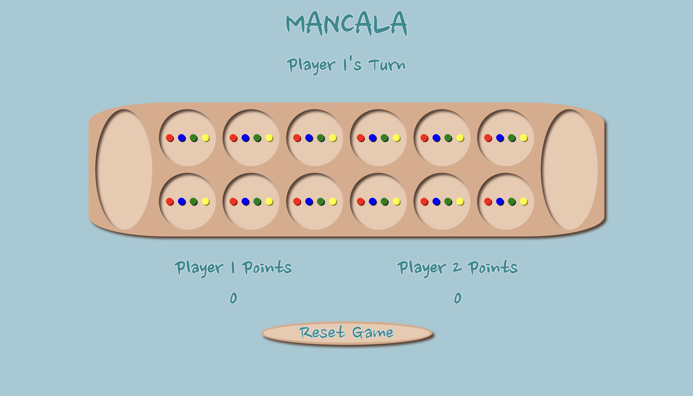
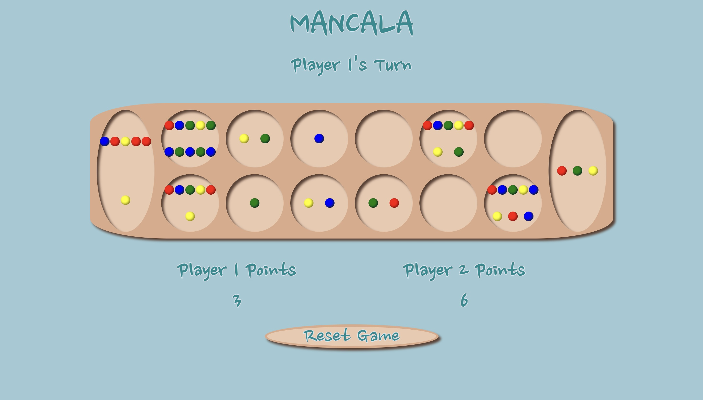
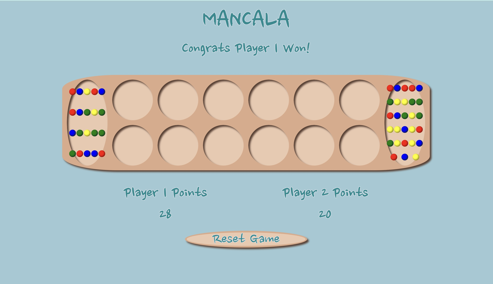

# **MANCALA**

## General Overview

Mancala is a two-player game that dates back to ancient times. The game starts out with 48 stones dispersed evenly between two rows of six pits. Two larger pits on either side are the "stores". Player 1 has access to the bottom row of pits and the store on the right. Player 2 has access to the top row and the store on the left. The objective of the game is to have the most stones in your store. To do this, each player takes turns choosing one of their pits to disperse the stones it contains. The stones get dispersed counter-clockwise, one at a time into each pit encountered; this can include your store. There are a few special rules that can be found below to help with your strategizing! Good luck!

## Special Conditions

*Play Again*  
If your last stone getting dispersed lands in your store, you can take another turn.

*Steal*  
If your last stone lands in an empty pit on your side, that stone goes to your store along with the stones in the pit across!

## Screenshots

## Technologies Used

- HTML
- CSS
- JavaScript

## Getting Started

The game can be accessed [here](https://anneclarin.github.io/mancala/). Reminder: This is a two-player game!

## Future Work

- **Add CPU Version**
This would be a good option for single players wanting to play and work on strategies. Varying difficuly settings would also be a nice addition to this component.
- **Adding Themes**
For better player experience and personalization, adding themes would be a nice touch. Themes can include: beach, forest, space, holidays, etc. Themes would involve the page's background, audio, and stone appearances.
